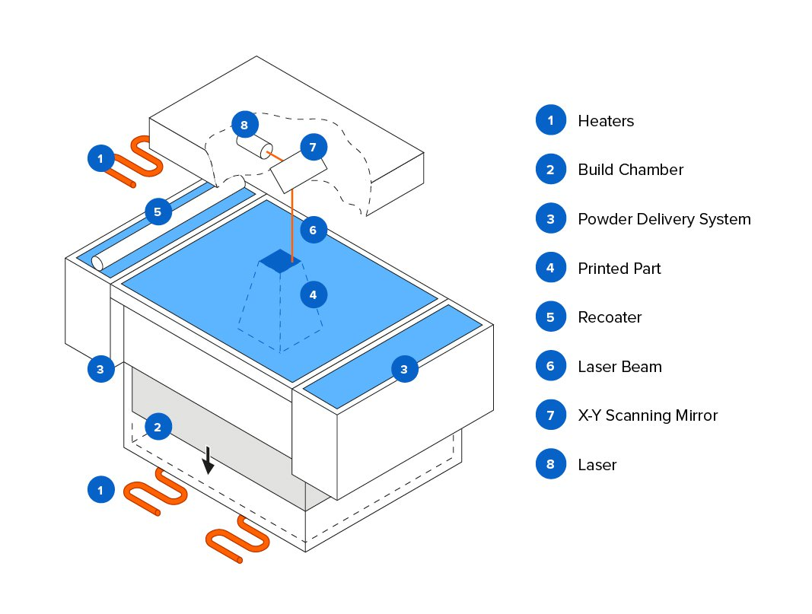

# todometer



## Download

Nab the latest version from the [Releases](https://github.com/cassidoo/todometer/releases) page!

## Development

- Clone the repo:

```bash
$ git clone https://github.com/cassidoo/todometer.git
```

- Go to the project directory and install dependencies:

```bash
$ cd Octopuss && npm install
```

To show the Electron application window with your current build:

```bash
$ npm run dev
`` 


```bash
$ npm install
$ npm run postinstall
$ npm run pre-electron-pack
$ npm run electron-pack
`
